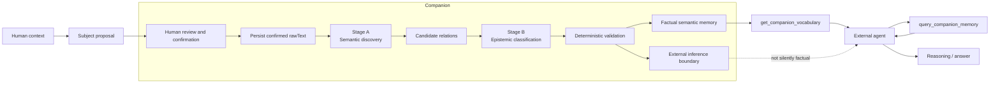

# Companion

**A human-to-agent memory layer built with WebMCP.**

Companion turns unstructured human context into confirmed, traceable semantic memory and exposes that memory through WebMCP as evidence that external agents can discover, retrieve, and reason over.

The application owns the trusted memory. WebMCP provides the interoperability layer. The external agent owns retrieval planning and final reasoning.

**Human context → Confirmed memory → WebMCP → Agent reasoning**

[Live demo](https://companion-webmcp-challenge.netlify.app/app/index.html) · [Video demo](https://youtu.be/jyoj31uBCTw) · [Source](https://github.com/AndreyBlanco/companion-webmcp) · [Architecture experiment](docs/experiments/ADAPTIVE-SEMANTIC-MEMORY-EXPERIMENT.md) · [Release evidence](docs/COMPETITION-RELEASE-EVIDENCE.md) · [Run it yourself](#run-it-yourself)

> This is an OpenAI WebMCP Challenge submission. All records in the repository and public demo are synthetic.

---

## The problem

Useful human context is constantly created as observations, measurements, decisions, hypotheses, events, and relationships.

Much of it remains spoken, unstructured, isolated in notes, or trapped inside individual applications.

Giving an AI agent access to that context creates another problem: who decides what is evidence, what is interpretation, and what can safely be reused later?

Companion explores a precise boundary:

> **Preserve human-confirmed context as source-traceable semantic memory, then let external agents retrieve that evidence and perform their own reasoning.**

“Trusted” here means **human-confirmed and source-traceable**, not objectively true.

**The app owns the evidence. The agent owns the reasoning.**

---

## Demo

The public demo starts empty.

A person can enter a synthetic observation in unrestricted natural language. Companion proposes a subject, but the human can review and correct both the original text and subject before anything becomes trusted memory.

After confirmation:

1. the confirmed source is preserved first;
2. semantic relations are discovered;
3. every candidate relation is epistemically classified;
4. deterministic validation checks structure, references, source grounding, and candidate correspondence;
5. source-grounded relations become eligible for factual memory;
6. agent-generated inference remains outside that factual boundary.

Semantic processing happens in the background while the person can continue capturing observations.

The resulting factual memory is exposed to compatible agents through WebMCP.

### Watch the demo

https://youtu.be/jyoj31uBCTw

The video demonstrates the central collaboration:

**Human evidence → Companion memory → WebMCP retrieval → External-agent reasoning**

---

## Why WebMCP?

Companion could expose its memory through a custom API and build a separate integration for every agent environment.

WebMCP changes that boundary.

The application can expose its capabilities directly from the page so that compatible agents can discover and invoke them without Companion being coupled to one specific agent runtime.

Companion therefore keeps responsibility for its own memory while exposing a small interoperable contract:

```text
Companion
    owns confirmed evidence
            │
            ▼
         WebMCP
    exposes capabilities
            │
            ▼
     External agent
    plans retrieval
    evaluates sufficiency
    performs reasoning
```

WebMCP does **not** create Companion's semantic memory and does **not** produce the final answer.

It is the interoperability layer between application-owned memory and agent-owned reasoning.

---

## Architecture



This separation is intentional.

Semantic discovery and epistemic classification are different problems. A model may discover a plausible relation without that relation being directly supported by the human source.

Companion preserves that distinction before persistence.

---

## Epistemic boundary

Every discovered semantic relation receives exactly one epistemic classification:

### `SOURCE_EXPLICIT`

The relation is directly stated in the confirmed source.

### `SOURCE_STRONGLY_IMPLIED`

The relation follows from local linguistic structure or an immediate relationship in the source without requiring specialized or diagnostic reasoning.

### `AGENT_INFERRED`

The relation requires model reasoning, causal interpretation, domain knowledge, diagnosis, synthesis, or information beyond what the source itself establishes.

Only:

```text
SOURCE_EXPLICIT
SOURCE_STRONGLY_IMPLIED
```

are eligible for factual persistence after deterministic validation.

`AGENT_INFERRED` is never silently promoted into factual memory and is excluded from the factual WebMCP retrieval path.

This allows an external agent to make interpretations without Companion rewriting those interpretations as human-confirmed facts.

---

## Human provenance is separate from epistemic status

Companion also preserves how information entered the human evidence:

- `observed`
- `measured`
- `reported`
- `speaker_inference`

These describe the human source.

They are intentionally different from `SOURCE_EXPLICIT`, `SOURCE_STRONGLY_IMPLIED`, and `AGENT_INFERRED`, which describe how strongly a semantic relation is grounded in that source.

For example, a technician may explicitly say:

> “I think the component is worn.”

That statement can be `SOURCE_EXPLICIT` as a representation of what the person said while still carrying `speaker_inference` as its human provenance.

Companion preserves the statement without converting the person's interpretation into objective truth.

---

## Raw evidence remains authoritative

The exact human-confirmed `rawText` is the primary source.

It is persisted before semantic processing begins.

A failure during semantic construction therefore does not erase the confirmed human evidence.

Semantic memory remains traceable to its source through record references and exact source evidence.

Model-generated structure does not gain factual authority merely because it was generated or persisted.

---

## Deterministic validation

After AI-assisted semantic construction, Companion performs mechanically verifiable checks without another model call.

Validation includes:

- valid node and relation types;
- valid identifiers and references;
- candidate identity and uniqueness;
- complete Stage A → Stage B correspondence;
- no silent candidate deletion or substitution;
- valid epistemic status;
- Entry/provenance boundaries;
- exact source-evidence validation;
- correct factual/inference routing.

Where exact source evidence is required, Companion verifies that the normalized evidence occurs in the normalized confirmed source.

The design principle is:

> **Pay for intelligence once; reuse the structured result deterministically.**

---

## Persistent identity

Model-generated IDs are treated as local construction identifiers.

Persistent semantic IDs belong to Companion.

This prevents model-local identifiers from becoming accidental persistent authority and allows independently constructed Entries to coexist without identifier collisions.

Each Entry remains a provenance and temporal boundary rather than being silently merged with previous evidence.

---

# WebMCP contract

Companion exposes two read-only WebMCP tools.

## 1. `get_companion_vocabulary`

Returns a deterministic, reusable projection of factual semantic relations for one subject.

Input:

```json
{
  "subjectId": "hyundai-accent-blue-2013"
}
```

`subjectId` may be omitted when the current active subject can be used.

The response contains:

- the exact subject;
- a deterministic `vocabularyVersion`;
- opaque vocabulary IDs;
- human-readable relation labels;
- evidence types useful to the calling agent.

Conceptually:

```json
{
  "subjectId": "hyundai-accent-blue-2013",
  "vocabularyVersion": "<deterministic-version>",
  "items": [
    {
      "id": "<opaque-companion-id>",
      "label": "<human-readable factual relation>",
      "evidenceTypes": ["..."]
    }
  ]
}
```

Companion does not interpret the agent's question when producing this vocabulary.

---

## 2. `query_companion_memory`

Retrieves factual memory by the exact vocabulary IDs selected by the external agent.

Input:

```json
{
  "subjectId": "hyundai-accent-blue-2013",
  "relevantVocabularyIds": [
    "<opaque-companion-id>"
  ]
}
```

Both fields are required.

The lookup is deterministic:

- requested IDs are deduplicated;
- selected factual relations are returned;
- endpoint nodes and source references are included;
- unknown IDs are reported explicitly;
- an empty ID list returns no evidence;
- Companion performs no ranking;
- Companion performs no automatic expansion;
- Companion does not decide whether the evidence is sufficient.

`AGENT_INFERRED` relations are excluded from this factual retrieval path.

---

## Incremental retrieval

The two-tool contract enables an external agent to retrieve memory incrementally.

```text
Question
   │
   ▼
External agent
   │
   ├── get_companion_vocabulary
   │
   ▼
select relevant IDs
   │
   ├── query_companion_memory [A]
   │
   ▼
evaluate evidence
   │
   ├── sufficient ─────────────► reason / answer
   │
   └── insufficient
           │
           ▼
     request additional IDs
           │
           ├── query_companion_memory [B, C]
           │
           ▼
     retain previous context
           │
           ▼
        reason / answer
```

Companion does not need an internal AI retrieval selector.

The same external agent that will reason over the evidence can decide what it needs, retrieve an initial subset, evaluate whether that context is sufficient, and request additional vocabulary IDs when necessary.

---

## What the agent receives — and what it does not

The WebMCP retrieval path exposes factual semantic memory and the evidence necessary to trace those relations back to confirmed human sources.

It intentionally does **not** return a generated final answer.

Companion does not:

- diagnose;
- synthesize the final conclusion;
- decide relevance from the user's question;
- rank semantic memory;
- decide sufficiency;
- silently convert agent inference into fact.

Those responsibilities belong to the external agent.

---

## Demo integrity

The public interface intentionally does not duplicate semantic memory into technical JSON panels or inspection payloads in the DOM.

After human confirmation or cancellation, temporary review text is cleared from the public interface when it is no longer needed there.

The reusable semantic-memory capability is exposed to agents through the WebMCP tool contract rather than through a parallel technical UI intended for scraping.

This is a demo-integrity boundary, not a claim that browser-session memory constitutes a security boundary.

---

## What we tested

The final challenge candidate was exercised at several boundaries.

| Test dimension | Result |
|---|---|
| Raw evidence preserved before semantic processing | PASS |
| Human confirmation boundary | PASS |
| Semantic discovery separated from epistemic classification | PASS |
| Every candidate classified exactly once | PASS |
| Stage A / Stage B no-deletion correspondence | PASS |
| Companion-owned persistent semantic IDs | PASS |
| Human provenance independent from epistemic status | PASS |
| Deterministic structural validation | PASS |
| Exact-source grounding validation | PASS |
| `AGENT_INFERRED` excluded from factual memory/WebMCP | PASS |
| v0.1 semantic metamodel enforcement | PASS |
| Reusable factual vocabulary | PASS |
| Exact deterministic lookup by external-agent-selected IDs | PASS |
| Incremental external-agent retrieval loop | PASS |
| Browser WebMCP discovery and invocation | PASS |
| Production end-to-end synthetic walkthrough | PASS |
| Public-surface inspection | PASS |

Final automated release verification:

```text
npm run test        PASS — 52/52
npm run check       PASS
npm run build       PASS
git diff --check    PASS
```

The production walkthrough additionally verified:

- capture, subject detection, review, and confirmation;
- real semantic processing;
- both WebMCP tools discoverable and invocable;
- exact retrieval of selected IDs;
- incremental retrieval across multiple calls;
- resolvable references;
- empty IDs returning zero evidence;
- unknown IDs reported explicitly;
- no `AGENT_INFERRED` relations in factual WebMCP results;
- no residual rawText or technical JSON dumps in the public DOM after confirmation.

These tests demonstrate the behavior of this challenge prototype. They are not a claim of production readiness or general-domain correctness.

---

## What we learned

Companion emerged from a sequence of experiments rather than from assuming the final architecture up front.

Several distinctions became important:

**Semantic recall is not epistemic correctness.**  
A model can discover a meaningful relation that the human never actually established.

**A candidate graph is not automatically a factual graph.**  
Semantic construction must be followed by an explicit factual boundary.

**Human provenance and model epistemics are different dimensions.**  
A person's inference can be faithfully preserved without being converted into objective truth.

**Retrieval planning does not need to live inside the memory system.**  
An external agent can inspect reusable vocabulary, request exactly the evidence it needs, evaluate sufficiency, and retrieve more context incrementally.

**WebMCP is most useful here as a boundary, not as the intelligence itself.**  
Companion owns memory; WebMCP exposes the capability; the agent owns reasoning.

---

## Known limitations

Companion v0.1 is an experimental challenge prototype.

- Public-demo memory is browser-session-local and resets when the page is reloaded or closed.
- Semantic construction uses a model and can be incomplete even when deterministic validation succeeds.
- The v0.1 semantic metamodel is deliberately limited.
- Semantic relation recall has not been optimized.
- The experiment corpus is small and synthetic.
- The external-inference lifecycle is intentionally not defined as a production persistence contract.
- Human adoption of agent-generated answers as future factual evidence is intentionally unresolved.
- The public semantic endpoint is protected by a demo access code rather than a production authentication system.
- Domain-neutral behavior is experimentally supported, not established across arbitrary domains.
- External-agent WebMCP behavior depends on the capabilities of the browser and agent environment.

These limitations are intentionally left visible rather than hidden behind stronger claims.

---

## Where could this pattern go?

The architecture is deliberately domain-neutral.

The same boundary could be explored for:

- a technician preserving observations about a machine;
- a mechanic preserving evidence about a vehicle;
- a teacher preserving context about a student;
- a salesperson preserving context about a client;
- a researcher preserving observations about an experiment.

These are possible applications of the pattern, not validated production domains.

---

# Run it yourself

Requirements:

- Node.js 24 or newer
- a WebMCP-compatible browser/environment for agent interaction

Clone and verify:

```sh
git clone https://github.com/AndreyBlanco/companion-webmcp.git
cd companion-webmcp
npm ci
npm test
npm run check
npm run build
npm run demo
```

Copy `.env.example` to an ignored `.env` or set the required variables in the process environment.

Open:

```text
http://127.0.0.1:4173
```

Then:

1. enter the demo access code;
2. enter a new synthetic natural-language observation;
3. review or correct the proposed subject and original text;
4. confirm it;
5. wait for semantic processing to report the graph ready;
6. add additional observations under the same subject if desired;
7. have a compatible external agent inspect `get_companion_vocabulary`;
8. let the agent select relevant vocabulary IDs;
9. invoke `query_companion_memory` with those IDs;
10. let the external agent evaluate sufficiency and reason over the returned evidence.

The application remains usable for human capture when WebMCP is unavailable.

### Public demo

https://companion-webmcp-challenge.netlify.app/app/index.html

The public demo starts empty and contains no preloaded evidence. Memory exists only for the lifetime of the browser page.

Judges receive the demo access code through the private credentials field in the challenge submission.

---

## Optional local audio validation

The local server retains an optional route for synthetic audio transcription.

Set `OPENAI_API_KEY` in the server environment, run `npm run demo`, and use only synthetic audio.

The route is not part of the deployed static challenge demo.

---

## Project structure

```text
src/core/              confirmed memory, semantic authority, retrieval
src/adapters/remote/   protected semantic endpoint adapter
src/webmcp/            WebMCP tool contracts and registration
src/app/               browser UI and local demo server
src/providers/         semantic extraction and optional transcription
tests/                 architecture, contract, retrieval and server gates
docs/experiments/      sanitized experimental record
fixtures/synthetic/    synthetic provenance records
```

The core contains no automotive-specific semantic schema.

The automotive scenario used in testing and the video is synthetic evidence chosen to make the memory/reasoning boundary easy to inspect.

---

## Challenge links

- **Live demo:** https://companion-webmcp-challenge.netlify.app/app/index.html
- **Video demo:** https://youtu.be/jyoj31uBCTw
- **Source code:** https://github.com/AndreyBlanco/companion-webmcp

---

## License

Licensed under the [MIT License](LICENSE).

Copyright © 2026 Andrey Blanco.