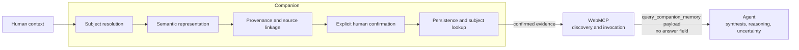

# Companion

**A human-to-agent memory layer built with WebMCP.**

Companion turns unstructured human context into confirmed, traceable semantic memory and exposes that memory through WebMCP as evidence that external agents can discover and query. The application owns the trusted memory, WebMCP provides the interoperability layer, and the agent owns the final reasoning.

**Human context → Confirmed memory → WebMCP → Agent reasoning**

[Live demo](https://companion-webmcp-challenge.netlify.app) · [Source](https://github.com/AndreyBlanco/companion-webmcp) · [Architecture experiment](docs/experiments/ADAPTIVE-SEMANTIC-MEMORY-EXPERIMENT.md) · [Release evidence](docs/COMPETITION-RELEASE-EVIDENCE.md) · [Run it yourself](#run-it-yourself)

This is an OpenAI WebMCP Challenge submission. All records in the repository and demo are synthetic.

## Human context disappears

Useful context is created as observations, measurements, decisions, hypotheses, events, and relationships. Much of it remains spoken, unstructured, isolated in notes, or trapped inside applications. Companion tests a precise boundary: preserve human-confirmed context as source-traceable evidence, then let agents retrieve that evidence without asking the memory system to invent the answer.

“Trusted” here means human-confirmed and source-traceable—not objectively true. **The app owns the evidence. The agent owns the reasoning.**

## From a human observation to agent evidence

The public demo includes an independently invented Hyundai Accent Blue 2013 diagnostic scenario. A protected server function uses one OpenAI structured-output call to turn each natural-language entry into a reviewable semantic draft.

**Positive control**

1. A person enters: `Hyundai Accent Blue 2013: el cilindro 2 no tiene chispa.`
2. Companion resolves the subject and proposes an `observed` claim: `spark_status = absent`.
3. Nothing persists until the person reviews and explicitly confirms the draft.
4. `query_companion_memory` receives `¿Qué evidencia apunta específicamente al cilindro 2?`.
5. Companion returns the confirmed source record and its linked semantic evidence. The calling agent—not Companion or WebMCP—decides what conclusion the evidence supports.

**Negative control**

A query for a subject with no confirmed memory returns no records and:

```json
{
  "records": [],
  "retrievalMetadata": {
    "subjectMemoryEmpty": true,
    "sufficiencyAssessment": "external_agent"
  }
}
```

There is no invented test result and no generated `answer` field.

## Why WebMCP is the right boundary

Companion could expose the same capability through a custom API. WebMCP matters because it gives compatible agents a discoverable, invocable application capability without coupling the memory system to one agent runtime.

**Companion owns the evidence. WebMCP exposes the capability. The agent owns the reasoning.**

WebMCP does not create semantic memory, perform retrieval, or reason over the result. It carries arguments to the application-owned capability and returns its evidence payload.

## Architecture: the app owns evidence, the agent owns reasoning



The application and WebMCP registration share the same `queryMemory` capability. Retrieval loads confirmed records only for the requested subject and returns them deterministically. The calling agent evaluates relevance and sufficiency. Semantic extraction uses a protected server-side OpenAI call; the browser never receives the provider key.

## What makes the memory trustworthy?

- **Raw evidence:** the exact confirmed `rawText` remains the primary evidence.
- **Provenance:** semantic items distinguish `observed`, `measured`, `reported`, `speaker_inference`, and `system_inference`.
- **Traceability:** every persisted semantic item carries the `sourceRecordId` of its confirmed record.
- **Confirmation:** interpretation creates a draft; persistence requires a separate confirmation action and token. Ambiguous subject resolution cannot persist.
- **Honest absence:** Companion reports whether subject memory is empty; the external agent determines whether returned evidence answers its question.

Human confirmation means the human confirmed the representation. It does not establish that the underlying statement is objectively true.

## The WebMCP tool

[`query_companion_memory`](src/webmcp/register.js) is read-only and accepts this input:

```json
{
  "question": "What evidence is relevant?",
  "subjectId": "optional-exact-subject-id",
  "evidenceTypes": ["entity", "claim", "measurement", "event", "relationship", "hypothesis"]
}
```

Only `question` is required. Without `subjectId`, the core uses the active subject. `evidenceTypes` optionally filters semantic kinds.

A reduced response shape is:

```json
{
  "subjectId": "hyundai-accent-blue-2013",
  "question": "...",
  "records": [
    {
      "recordId": "...",
      "rawText": "...",
      "evidence": [
        {
          "kind": "claim",
          "predicate": "spark_status",
          "value": "absent",
          "provenance": "observed",
          "sourceRecordId": "..."
        }
      ]
    }
  ],
  "retrievalMetadata": {
    "recordsConsidered": ["..."],
    "recordsReturned": ["..."],
    "subjectMemoryEmpty": false,
    "sufficiencyAssessment": "external_agent"
  }
}
```

There is intentionally no `answer` field. The payload is evidence for the calling agent to interpret.

## We tried to break it

The sanitized experiment record is intentionally smaller than the laboratory that produced it. It preserves the claims that can be audited publicly:

| Test dimension | Result | Public evidence |
|---|---|---|
| Exact source retention, provenance, and source linkage | PASS | [Core tests](tests/semantic-memory.test.js) |
| Explicit confirmation; ambiguous subjects cannot persist | PASS | [Core tests](tests/semantic-memory.test.js) |
| Active-subject continuity and progressive memory | PASS | [Core tests](tests/semantic-memory.test.js) |
| Subject-first retrieval | PASS | [Core tests](tests/semantic-memory.test.js) |
| Protected dynamic semantic endpoint | PASS, local | [Endpoint tests](tests/semantic-endpoint.test.js) |
| Missing-evidence negative control | PASS | [Core tests](tests/semantic-memory.test.js) |
| Browser WebMCP discovery and invocation | PASS, local and public RC | [Release evidence](docs/COMPETITION-RELEASE-EVIDENCE.md) |
| Deterministic subject lookup for external-agent reasoning | PASS | [Core tests](tests/semantic-memory.test.js) |

Earlier synthetic experiments showed that lexical search could miss paraphrases and select irrelevant records that shared words. The adaptive semantic-memory experiment then demonstrated additive, source-linked semantic deltas from natural text, active-subject continuity, explicit ambiguity, provenance preservation, subject-first filtering, positive selection, and an honest negative result. The preserved release verdict is **GO — Competition Release Candidate**, with the limitations below.

See the [adaptive semantic memory experiment](docs/experiments/ADAPTIVE-SEMANTIC-MEMORY-EXPERIMENT.md), [reliability experiments](docs/experiments/RELIABILITY-EXPERIMENTS.md), and [semantic architecture freeze](docs/experiments/SEMANTIC-ARCHITECTURE-FREEZE.md).

## Architecture experiment vs. public competition demo

| | Architecture experiment | Public competition demo |
|---|---|---|
| Input path | Unstructured natural language | Deterministic synthetic scenario |
| Semantic representation | Model-generated structured semantic graph | Protected model-generated semantic delta |
| Memory contract | Additive, source-linked, confirmed | The same frozen contract |
| WebMCP boundary | Evidence returned for agent reasoning | The same `query_companion_memory` boundary |
| Purpose | Test richer graph and retrieval protocols | Demonstrate the confirmed memory and WebMCP collaboration loop |

The public path supports dynamic semantic extraction through one OpenAI provider. Strict schema validation, exact source excerpts, explicit review, and confirmation bound the result. It remains an experimental demo rather than a production extraction service.

## What we learned

The work progressed through failures: structured observations exposed the limits of lexical retrieval; semantic extraction enabled additive memory; ambiguous references required explicit subject resolution; and external browser validation established real WebMCP discovery and invocation. The final demo sends the subject's small confirmed memory to the calling agent instead of pretending that Companion knows what the agent needs. Each correction stayed generic rather than introducing an automotive-specific core schema.

## Known limitations

- Semantic completeness can vary in the model-driven architecture experiment.
- Subject lookup returns every confirmed record for the requested subject; this is intentionally simple and may transfer evidence the agent does not need.
- Model-generated semantic drafts can be incomplete or require human correction; only synthetic inputs are authorized for the public demo.
- Public demo memory is browser-session-local and resets on reload.
- The semantic endpoint is billable and protected by a judge access code. It has no user accounts or production authorization.
- Domain-neutral modeling is supported by one synthetic automotive diagnostic experiment, not validated across arbitrary domains.

## Where could this pattern go?

The same boundary could be tested for a teacher preserving context about a student, a mechanic about a vehicle, a technician about a machine, a salesperson about a client, or a researcher about an experiment. These are possible applications of the pattern, not validated domains or production claims.

## Run it yourself

Requirements: Node.js 24 or newer. There are no npm package dependencies.

```sh
git clone https://github.com/AndreyBlanco/companion-webmcp.git
cd companion-webmcp
npm ci
npm test
npm run check
npm run build
npm run demo
```

Copy `.env.example` to an ignored `.env` or set its variables in the process environment. Open `http://127.0.0.1:4173`, enter the demo access code, and use the three provided Hyundai entries in order. Review and confirm each draft, then ask an agent in a compatible browser to invoke `query_companion_memory`. The application flow remains usable when WebMCP is unavailable.

The same protected flow is intended for the [public demo](https://companion-webmcp-challenge.netlify.app). Judges receive the access code through the private credentials field in Devpost.

### Optional local audio validation

The local server retains one optional route that sends audio to OpenAI's `gpt-transcribe` endpoint. Set `OPENAI_API_KEY` in the server environment, run `npm run demo`, and use only synthetic audio. The route accepts at most 10 MiB, does not save audio, may consume API credits, and is not part of the deployed static demo.

`npm run demo:lan` exposes the local server to a trusted LAN for controlled phone testing. Direct microphone capture commonly requires HTTPS away from `localhost`; the file path remains available. Stop the server after the test because the local paid route has no production authentication.

## Reproducibility

The frozen deterministic RC at `ff3e25590b4ad439c8b8b57bc7d8cba79fbbf004` records the historical gates below. They do not certify later dynamic-provider changes, which require a new closure record before submission:

| Gate | Result |
|---|---|
| Automated tests | PASS — 10 passed, 0 failed |
| Syntax check | PASS |
| Build | PASS |
| Clean checkout install, test, check, and build | PASS |
| Public deployment | PASS |
| WebMCP discovery | PASS — local and public origin |
| WebMCP invocation | PASS — local and public origin |
| Positive control | PASS — confirmed cylinder 2 evidence selected |
| Negative control | PASS — no compression evidence was returned as an answer; the external agent reported the information absent |
| No fabricated answer | PASS — payload contains no `answer` field |

The detailed commands, deployment checks, isolation audit, and limitations are in [Competition Release Evidence](docs/COMPETITION-RELEASE-EVIDENCE.md). Release evidence is historical evidence for that exact candidate, not a promise about unverified future changes.

## Project structure

```text
src/core/                  confirmation, memory, subject-first retrieval
src/adapters/remote/       protected semantic endpoint adapter
src/webmcp/                WebMCP tool contract and registration
src/app/                   browser UI and local demo server
src/providers/             OpenAI semantic extraction and optional transcription
tests/                     architecture, contract, and server gates
docs/experiments/          sanitized experimental record
docs/COMPETITION-RELEASE-EVIDENCE.md
fixtures/synthetic/        synthetic provenance record
```

The core contains no automotive-specific schema; the demo adapter owns the scenario-specific behavior. Broader domain-neutral behavior remains experimentally supported, not generally validated. Application and WebMCP paths reuse the same internal capabilities.

## Challenge and license

Companion is an OpenAI WebMCP Challenge submission. No challenge URL is included because the repository does not contain a verified canonical destination.

Licensed under the [MIT License](LICENSE). Copyright © 2026 Andrey Blanco.
